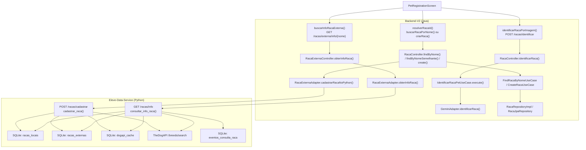
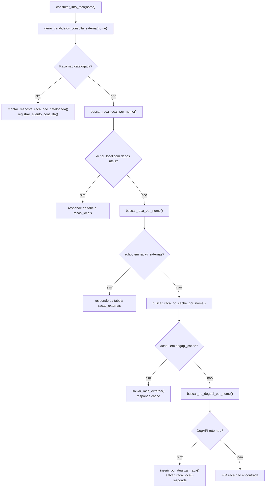

# Fluxo do Eleve-Data-Service

## Resumo rapido

No cadastro de pet, existem 3 fluxos diferentes relacionados a raca:

1. `Foto -> IA`
   Esse fluxo passa pelo frontend e pelo backend Java, mas **nao entra no Python**.
2. `Nome da raca -> dados enriquecidos`
   Esse fluxo vai do frontend para o backend Java e, quando necessario, chega no `Eleve-Data-Service` em Python.
3. `Criacao automatica da raca`
   Quando a raca nao existe no Java, ela e criada no backend Java e depois o Java tenta pre-carregar a mesma raca no Python.

## Visao geral



## Fluxo 1: foto do pet -> IA

Esse fluxo **nao bate no Python**. Ele termina no Java, dentro do `GeminiAdapter`.

### Sequencia

1. A tela [`PetRegistration.js`](../Eleve-App/src/screens/PetRegistration.js) chama `identificarRaca(fotoPet)`.
2. `identificarRaca()` chama `identificarRacaPorImagem()`.
3. O frontend envia `POST /racas/identificar`.
4. O backend Java recebe em `RacaController.identificarRaca()`.
5. O controller delega para `IdentificarRacaPetUseCase.execute()`.
6. O use case valida tipo e tamanho da imagem.
7. O use case chama `GeminiAdapter.identificarRaca()`.
8. O `GeminiAdapter` chama o Gemini e devolve JSON com sugestoes.
9. O frontend usa a primeira sugestao para disparar o fluxo 2.

### Classes/metodos tocados

- Frontend
  - `PetRegistrationScreen.identificarRaca()`
  - `identificarRacaPorImagem()`
- Java
  - `RacaController.identificarRaca()`
  - `IdentificarRacaPetUseCase.execute()`
  - `GeminiAdapter.identificarRaca()`

## Fluxo 2: nome da raca -> dados enriquecidos

Esse e o fluxo principal que realmente atravessa `front -> Java -> Python`.

### Sequencia

1. A tela chama `selecionarSugestao(nome)` ou `buscarDadosDogApi(nome)`.
2. O frontend normaliza candidatos de nome em `deParaRacas.js`.
3. O frontend envia `GET /racas/externa/info/{nome}`.
4. O backend Java recebe em `RacaExternaController.obterInfoRaca()`.
5. O controller delega para `RacaExternaAdapter.obterInfoRaca(nome)`.
6. O adapter tenta primeiro o cache local do Java:
   - `RacaExternaRepository.findFirstByNomeIgnoreCaseOrNomeOriginalIgnoreCase(...)`
   - tabela JPA `racas_externas`
7. Se o Java achar no proprio banco, ele responde sem chamar Python.
8. Se o Java nao achar, ele chama `GET {URL_DADOS_PY}/racas/info?nome=...`.
9. O Python entra em `consultar_info_raca(nome)`.
10. O Python tenta nesta ordem:
    - `racas_locais`
    - `racas_externas`
    - `dogapi_cache`
    - `TheDogAPI /breeds/search`
11. O Python registra analytics em `eventos_consulta_raca`.
12. O Python devolve a resposta para o Java.
13. O Java salva/atualiza o cache local dele em `racas_externas`.
14. O frontend recebe os campos e exibe grupo, peso, altura, expectativa de vida e temperamento.

### Classes/metodos tocados

- Frontend
  - `PetRegistrationScreen.selecionarSugestao()`
  - `PetRegistrationScreen.buscarDadosDogApi()`
  - `buscarInfoRacaExterna()`
  - `obterCandidatosRacaParaConsultaExterna()`
- Java
  - `RacaExternaController.obterInfoRaca()`
  - `RacaExternaAdapter.obterInfoRaca()`
  - `RacaExternaRepository`
  - `RacaExternaEntity`
- Python
  - `obter_info_raca_por_query()`
  - `consultar_info_raca()`
  - `gerar_candidatos_consulta_externa()`
  - `buscar_raca_local_por_nome()`
  - `buscar_raca_por_nome()`
  - `buscar_raca_no_cache_por_nome()`
  - `buscar_no_dogapi_por_nome()`
  - `salvar_raca_externa()`
  - `salvar_raca_local()`
  - `registrar_evento_consulta()`

### Diagrama interno do Python



## Fluxo 3: criacao da raca no Java + pre-cadastro no Python

Esse fluxo acontece quando `resolverRacaId()` nao encontra a raca no backend Java e precisa cria-la.

### Sequencia

1. O frontend chama `buscarRacaPorNome()`.
2. Se a busca exata e a aproximada falharem, o frontend chama `criarRaca()`.
3. O frontend envia `POST /racas`.
4. O backend Java recebe em `RacaController.create()`.
5. O controller converte `RacaDTO -> Raca` com `RacaDtoMapper.toDomain()`.
6. O mapper busca o porte em `PorteRepository`.
7. O controller chama `CreateRacaUseCase.execute()`.
8. O use case usa `RacaRepository.existsByNome()` e depois `save()`.
9. `RacaRepositoryImpl` usa `RacaMapper` e `RacaJpaRepository`.
10. Depois que grava no Java, o controller chama `RacaExternaAdapter.cadastrarRacaNoPython(nome)`.
11. O Java envia `POST {URL_DADOS_PY}/racas/cadastrar`.
12. O Python recebe em `cadastrar_raca()`.
13. O Python tenta enriquecer a raca usando:
    - `racas_locais`
    - `racas_externas`
    - `dogapi_cache`
    - `TheDogAPI /breeds/search`
14. O Python grava a raca local dele com `salvar_raca_local()`.

### Classes/metodos tocados

- Frontend
  - `PetRegistrationScreen.resolverRacaId()`
  - `buscarRacaPorNome()`
  - `criarRaca()`
- Java
  - `RacaController.findByNome()`
  - `RacaController.findByNomeSemelhante()`
  - `RacaController.create()`
  - `RacaDtoMapper.toDomain()`
  - `FindRacaByNomeUseCase.execute()`
  - `CreateRacaUseCase.execute()`
  - `RacaRepositoryImpl.findByNome()`
  - `RacaRepositoryImpl.existsByNome()`
  - `RacaRepositoryImpl.save()`
  - `RacaMapper.toEntity()`
  - `RacaJpaRepository.save()`
  - `RacaExternaAdapter.cadastrarRacaNoPython()`
- Python
  - `cadastrar_raca()`
  - `buscar_raca_local_por_nome()`
  - `buscar_raca_por_nome()`
  - `buscar_raca_no_cache_por_nome()`
  - `buscar_no_dogapi_por_nome()`
  - `salvar_raca_local()`
  - `salvar_raca_externa()`

## Fluxo 4: ETL e sincronizacao da base Python

Esse fluxo nao vem diretamente da tela de cadastro, mas e importante para entender de onde o Python tira os dados.

### Na subida do Python

1. `iniciar_aplicacao()`
2. `inicializar_banco()`
3. `sincronizar_racas_iniciais_se_necessario()`
4. Se a base estiver incompleta, chama `executar_sincronizacao_etl()`
5. O ETL consome `TheDogAPI /breeds`
6. O Python preenche:
   - `dogapi_cache`
   - `racas_externas`
   - `execucoes_sincronizacao`
7. Depois agenda sync diario com `APScheduler`

### Via backend Java

```text
POST /api/racas/externa/etl/sync
-> RacaExternaController.sincronizarRacasExternas()
-> RacaExternaAdapter.sincronizarRacas()
-> POST {URL_DADOS_PY}/etl/sync/racas
-> sincronizar_racas()
-> executar_sincronizacao_etl()
-> TheDogAPI /breeds
```

## Bancos e tabelas envolvidos

### No backend Java

- Tabela `raca`
  - persistida por `RacaJpaRepository`
  - usada para o dominio principal da raca no sistema Java
- Tabela `racas_externas`
  - persistida por `RacaExternaRepository`
  - usada como cache local do Java para dados enriquecidos

### No Python

- `racas_locais`
  - base local enriquecida ou manual
- `racas_externas`
  - base externa normalizada
- `dogapi_cache`
  - cache bruto/operacional vindo da TheDogAPI
- `eventos_consulta_raca`
  - analytics de consulta
- `execucoes_sincronizacao`
  - historico do ETL

## Ponto mais importante

Se a pergunta for "qual caminho do app realmente bate no `Eleve-Data-Service`?", a resposta principal e:

```text
PetRegistrationScreen.buscarDadosDogApi()
-> buscarInfoRacaExterna()
-> GET /api/racas/externa/info/{nome}
-> RacaExternaController.obterInfoRaca()
-> RacaExternaAdapter.obterInfoRaca()
-> GET /racas/info?nome=...
-> consultar_info_raca()
```

E o segundo caminho que tambem bate no Python e:

```text
PetRegistrationScreen.resolverRacaId()
-> criarRaca()
-> POST /api/racas
-> RacaController.create()
-> CreateRacaUseCase.execute()
-> RacaExternaAdapter.cadastrarRacaNoPython()
-> POST /racas/cadastrar
-> cadastrar_raca()
```

## Arquivos principais para abrir primeiro

- Frontend
  - `Eleve-App/src/screens/PetRegistration.js`
  - `Eleve-App/src/api/racas/identificarRacaPorImagem.js`
  - `Eleve-App/src/api/racas/buscarInfoRacaExterna.js`
  - `Eleve-App/src/api/racas/deParaRacas.js`
  - `Eleve-App/src/api/racas/buscarRaca.js`
  - `Eleve-App/src/api/racas/criarRaca.js`
- Backend Java
  - `Backend-V2/src/main/java/codifica/eleve/interfaces/controller/RacaController.java`
  - `Backend-V2/src/main/java/codifica/eleve/interfaces/controller/RacaExternaController.java`
  - `Backend-V2/src/main/java/codifica/eleve/infrastructure/adapters/RacaExternaAdapter.java`
  - `Backend-V2/src/main/java/codifica/eleve/infrastructure/adapters/GeminiAdapter.java`
  - `Backend-V2/src/main/java/codifica/eleve/core/application/usecase/raca/IdentificarRacaPetUseCase.java`
- Python
  - `Eleve-Data-Service/main.py`
